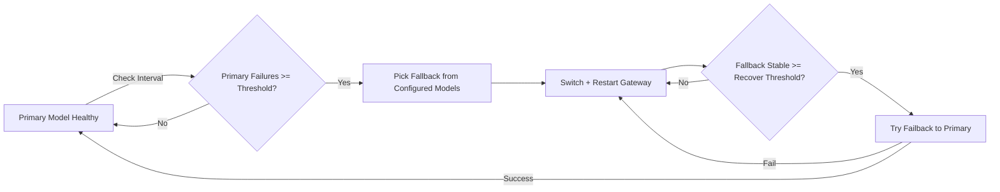
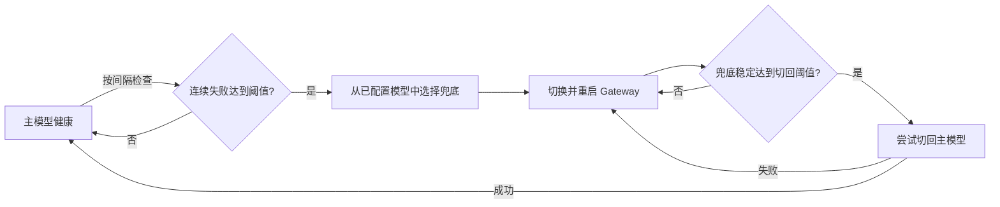

# OpenClaw Model Failover Guard

[English](#english) | [中文](#中文)

<a id="english"></a>



---

## English

Automatic model failover + failback guard for OpenClaw.

When your primary model becomes unstable, this guard can switch to an available fallback model automatically, then switch back to the primary after stability is restored.

### Overview

- Monitor model health on an interval
- If primary fails N times consecutively → failover
- Fallback is selected from **all configured models**
- Supports preferred fallback provider
- After fallback is stable for N checks → try failback
- If failback test fails → revert to fallback immediately

### Install

```bash
npx skills add https://github.com/BovmantH/openclaw-model-failover-guard.git --skill model-failover-guard
```

### Files

| Path | Purpose |
|---|---|
| `skills/model-failover-guard/SKILL.md` | Skill definition |
| `skills/model-failover-guard/config.example.json` | Config template |
| `skills/model-failover-guard/scripts/failover.py` | Runtime guard script |

### Config

Copy `config.example.json` to `config.json`.

| Key | Description |
|---|---|
| `primaryModel` | Optional. Empty = use OpenClaw current default model |
| `preferredFallbackProvider` | Optional preferred fallback provider |
| `excludedProviders` | Providers excluded from fallback candidates |
| `failThreshold` | Consecutive failures before failover |
| `recoverThreshold` | Stable checks before failback |
| `checkIntervalSec` | Health check interval (seconds) |
| `testTimeoutSec` | Single test timeout (seconds) |

### Run

```bash
python3 skills/model-failover-guard/scripts/failover.py once
python3 skills/model-failover-guard/scripts/failover.py loop
```

### State & Logs

- State: `~/.openclaw/failover-state.json`
- Log: `~/.openclaw/failover.log`

### Run as Systemd Service (Linux)

#### Install service

```bash
mkdir -p ~/.config/systemd/user
cp skills/model-failover-guard/skills/model-failover-guard/openclaw-model-failover.service ~/.config/systemd/user/
systemctl --user daemon-reload
```

#### Enable & Start

```bash
systemctl --user enable --now openclaw-model-failover
```

#### Logs

```bash
journalctl --user -u openclaw-model-failover -f
```

### FAQ

**Q: Failback to primary is not happening. What should I do?**  
A: Check `~/.openclaw/failover.log`. You can also run `python3 skills/model-failover-guard/scripts/failover.py once` manually.

**Q: Log file is too large.**  
A: Rotate/clean periodically. Example: `echo "" > ~/.openclaw/failover.log`

**Q: How to stop the guard completely?**  
A: `systemctl --user stop openclaw-model-failover` (if using systemd), or kill the process.

**Q: Can I run multiple instances?**  
A: Not recommended. Run only one instance per machine.

---

<a id="中文"></a>

## 中文



这是一个 OpenClaw 模型自动故障切换 + 自动切回守护技能。

当主模型不稳定时，守护进程会自动切换到可用的兜底模型，并在稳定后自动尝试切回主模型。

### 概览

- 按固定间隔检测模型健康
- 主模型连续失败 N 次后触发故障切换
- 兜底模型从**全部已配置模型**中选择
- 支持设置优先 fallback provider
- 兜底稳定 N 次后尝试切回主模型
- 切回失败会立即回退到兜底，防止抖动

### 安装

```bash
npx skills add https://github.com/BovmantH/openclaw-model-failover-guard.git --skill model-failover-guard
```

### 文件

| 路径 | 用途 |
|---|---|
| `skills/model-failover-guard/SKILL.md` | 技能定义 |
| `skills/model-failover-guard/config.example.json` | 配置模板 |
| `skills/model-failover-guard/scripts/failover.py` | 运行脚本 |

### 配置

复制 `config.example.json` 为 `config.json`。

| 键 | 说明 |
|---|---|
| `primaryModel` | 可选；空则使用 OpenClaw 当前默认主模型 |
| `preferredFallbackProvider` | 可选的优先兜底 provider |
| `excludedProviders` | 不参与兜底的 provider 列表 |
| `failThreshold` | 触发故障切换的连续失败阈值 |
| `recoverThreshold` | 触发切回主模型的稳定检查阈值 |
| `checkIntervalSec` | 健康检查间隔（秒） |
| `testTimeoutSec` | 单次测试超时（秒） |

### 运行

```bash
python3 skills/model-failover-guard/scripts/failover.py once
python3 skills/model-failover-guard/scripts/failover.py loop
```

### 状态与日志

- 状态：`~/.openclaw/failover-state.json`
- 日志：`~/.openclaw/failover.log`

### 作为 Systemd 服务运行（Linux）

#### 安装服务

```bash
mkdir -p ~/.config/systemd/user
cp skills/model-failover-guard/skills/model-failover-guard/openclaw-model-failover.service ~/.config/systemd/user/
systemctl --user daemon-reload
```

#### 启用并启动

```bash
systemctl --user enable --now openclaw-model-failover
```

#### 查看日志

```bash
journalctl --user -u openclaw-model-failover -f
```

### 常见问题

**问：切不回主模型怎么办？**  
答：检查 `~/.openclaw/failover.log`，也可以手动运行 `python3 skills/model-failover-guard/scripts/failover.py once`。

**问：日志文件太大怎么办？**  
答：定期清理或用 logrotate。例如：`echo "" > ~/.openclaw/failover.log`

**问：如何完全停止守护？**  
答：如果用了 systemd，执行 `systemctl --user stop openclaw-model-failover`，或直接 kill 进程。

**问：可以同时跑多个实例吗？**  
答：不建议，同一台机器只跑一个实例。

---

## License

MIT License · Copyright © 2026 BovmantH

See [LICENSE](./LICENSE) for full text.
